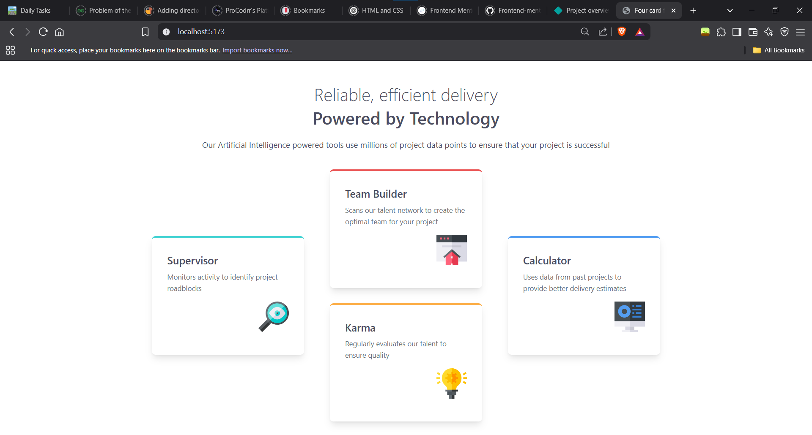

# Frontend Mentor - Four card feature section solution

## Table of contents

- [Overview](#overview)
  - [The challenge](#the-challenge)
  - [Screenshot](#screenshot)
- [My process](#my-process)
  - [Built with](#built-with)
  - [What I learned](#what-i-learned)

## Overview

### The challenge

Users should be able to:

- View the optimal layout for the site depending on their device's screen size

### Screenshot




## My process

### Built with

- Semantic HTML5 markup
- CSS custom properties
- Flexbox
- CSS Grid
- Mobile-first workflow
- [React](https://reactjs.org/) - JS library
- [Tailwind CSS](https://tailwindcss.com/)

### What I learned

- How to structure a responsive grid layout using Tailwind CSS.
- Using custom color and font size utilities in Tailwind config.
- Combining CSS Grid and Flexbox for complex layouts.
- Creating reusable card components with semantic HTML.
- Responsive design techniques for different screen sizes.
- How to use custom fonts and style headings and body text distinctly.

#### Example code

```jsx
<div className="grid grid-cols-1 sm:grid-cols-2 lg:grid-cols-3 gap-8 max-w-[1090px] mx-auto">
  <section className="rounded-lg shadow-lg p-8 border-t-4 border-t-cyan lg:row-span-2">
    <h2 className="text-preset-3 text-grey-500">Supervisor</h2>
    <p className="text-preset-5 text-grey-400 my-2">
      Monitors activity to identify project roadblocks
    </p>
    
  </section>
</div>

// [tailwind.config.js](http://_vscodecontentref_/0) snippet
theme: {
  extend: {
    colors: {
      'cyan': 'hsl(180, 62%, 55%)',
      'red': 'hsl(0, 78%, 62%)',
      'orange': 'hsl(34, 97%, 64%)',
      'blue': 'hsl(212, 86%, 64%)',
      'grey-500': 'hsl(234, 12%, 34%)',
      'grey-400': 'hsl(212, 6%, 44%)',
    }
  },
  fontSize: {
    'preset-1': ['36px', { lineHeight: '1.4', letterSpacing: '0.25px', fontFamily: ['Poppins', 'sans-serif'], fontWeight: '600' }],
    // ...other presets
  }
}