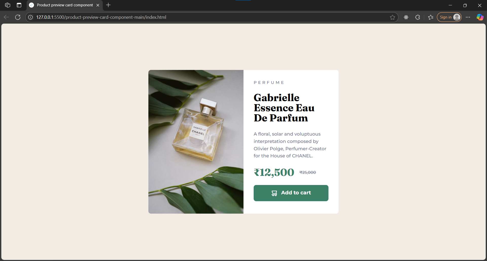
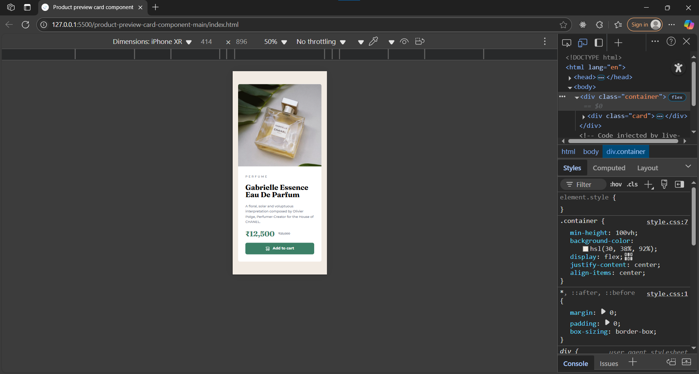

# Frontend Mentor - Product preview card component solution

This is a solution to the [Product preview card component challenge on Frontend Mentor](https://www.frontendmentor.io/challenges/product-preview-card-component-GO7UmttRfa). Frontend Mentor challenges help you improve your coding skills by building realistic projects.

## Table of contents

- [Overview](#overview)
  - [The challenge](#the-challenge)
  - [Screenshot](#screenshot)
- [My process](#my-process)
  - [Built with](#built-with)
  - [What I learned](#what-i-learned)

## Overview

### The challenge

Users should be able to:

- View the optimal layout depending on their device's screen size
- See hover and focus states for interactive elements

### Screenshot




## My process

### Built with

- Semantic HTML5 markup
- CSS custom properties
- Flexbox
- Mobile-first workflow
- [Montserrat](https://fonts.google.com/specimen/Montserrat) and [Fraunces](https://fonts.google.com/specimen/Fraunces) fonts

### What I learned

- How to structure a product card using semantic HTML for accessibility.
- Using Flexbox for responsive layouts and centering content.
- Applying HSL color values for easy theme management.
- Styling buttons and interactive elements with custom hover/focus states.
- Responsive design techniques for different screen sizes.
- How to use custom fonts and style headings and body text distinctly.

#### Example code

```html
<button class="btn">
  
  Add to cart
</button>
```

```css
.btn {
  width: 100%;
  background-color: hsl(158, 36%, 37%);
  color: hsl(0, 0%, 100%);
  font-family: 'Montserrat', sans-serif;
  font-size: 1rem;
  font-weight: 700;
  line-height: 1;
  padding: 1rem 2rem;
  border-radius: 0.5rem;
  border: none;
  cursor: pointer;
  transition: background-color 0.3s ease;
}
.cart-icon {
  width: 1.2em;
  height: 1.2em;
  vertical-align: middle;
  margin-right: 0.5em;
}
```
