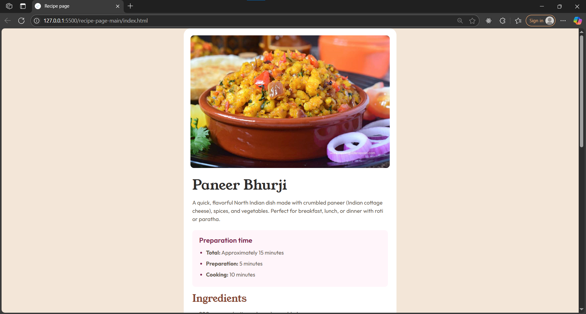

# Frontend Mentor - Recipe Page Solution

This is a solution to the [Recipe page challenge on Frontend Mentor](https://www.frontendmentor.io/challenges/recipe-page-UGRc8pJCa). Frontend Mentor challenges help you improve your coding skills by building realistic projects.

## Table of contents

- [Overview](#overview)
  - [The challenge](#the-challenge)
  - [Screenshot](#screenshot)
- [My process](#my-process)
  - [Built with](#built-with)
  - [What I learned](#what-i-learned)

## Overview

### The challenge

Users should be able to:

- View the recipe page on mobile and desktop screens
- See hover and focus states for all interactive elements on the page

### Screenshot




## My process

### Built with

- Semantic HTML5 markup
- CSS custom properties
- Flexbox
- Mobile-first workflow
- [Outfit](https://fonts.google.com/specimen/Outfit) and [Young Serif](https://fonts.google.com/specimen/Young+Serif) fonts

### What I learned

- How to structure a recipe page using semantic HTML for accessibility.
- Using Flexbox for layout and centering content.
- Applying HSL color values for easy theme management.
- Styling lists and tables to match a design system.
- Responsive design techniques for different screen sizes.
- How to use custom fonts and style headings and body text distinctly.

#### Example code

```html
<section class="ingredients">
  <h2>Ingredients</h2>
  <ul>
    <li>200g paneer (cottage cheese), crumbled</li>
    <li>1 tablespoon oil or ghee</li>
    <!-- ... -->
  </ul>
</section>
```

```css
.preparation-time ul li::marker {
  color: hsl(332, 51%, 32%);
  font-size: 1.2em;
}
.container {
  background-color: hsl(0, 0%, 100%);
  max-width: 620px;
  margin: 0 auto;
  border-radius: 20px;
}
```
