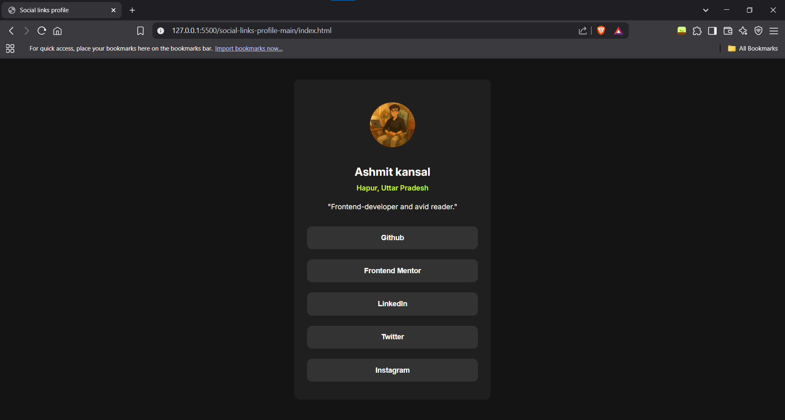

## Table of contents

- [Overview](#overview)
  - [The challenge](#the-challenge)
  - [Screenshot](#screenshot)
- [My process](#my-process)
  - [Built with](#built-with)
  - [What I learned](#what-i-learned)

## Overview

### The challenge

Users should be able to:

- See hover and focus states for all interactive elements on the page

### Screenshot



## My process

### Built with

- Semantic HTML5 markup
- CSS custom properties
- Flexbox
- Mobile-first workflow
- [Inter](https://fonts.google.com/specimen/Inter) font

### What I learned

- Improved my understanding of semantic HTML structure for accessibility.
- Practiced using Flexbox for centering and layout.
- Used HSL color values and custom properties for easier theme management.
- Implemented smooth hover transitions for interactive elements.
- Ensured the design is responsive and looks good on different screen sizes.

#### Example code

```html
<button class="button" onclick="window.open('https://github.com/Ashmit-kansal', '_blank')">Github</button>
```

```css
.button {
  background-color: hsl(0, 0%, 20%);
  color: hsl(0, 0%, 100%);
  transition: background-color 0.6s, color 0.6s;
}
.button:hover {
  background-color: hsl(75, 94%, 57%);
  color: hsl(0, 0%, 20%);
}
```

