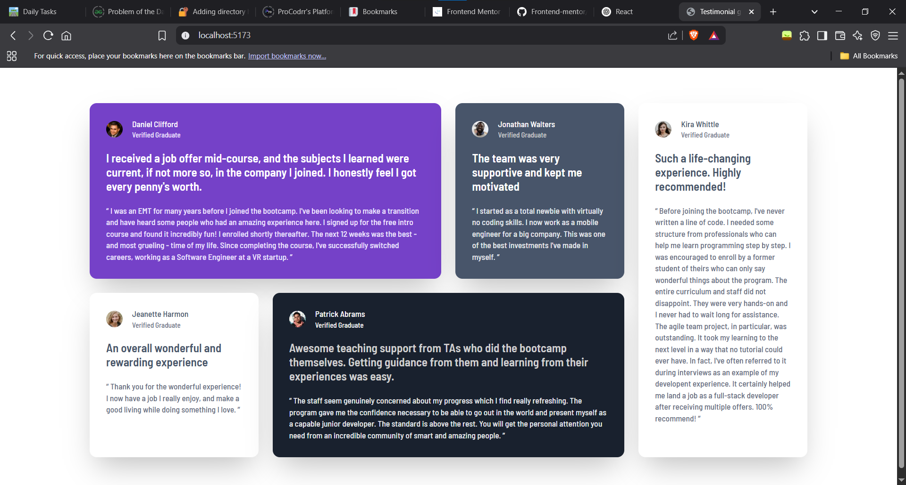
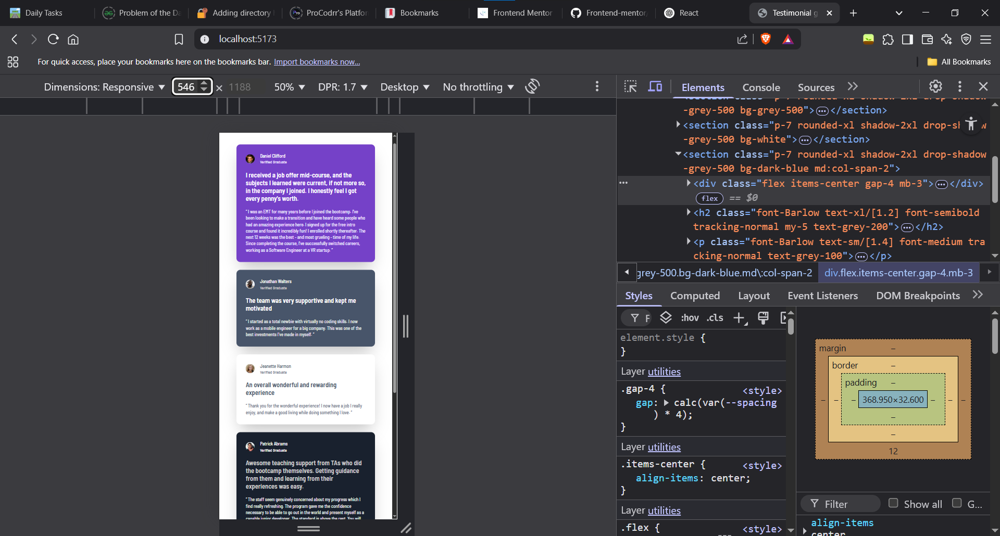

# Frontend Mentor - Testimonial Grid Section Solution

A responsive testimonial grid built with **React**, **Vite**, and **Tailwind CSS**.  
This project is a solution to the [Frontend Mentor Testimonial Grid Section Challenge](https://www.frontendmentor.io/challenges/testimonials-grid-section-Nnw6J7Un7).

---

## Table of contents

- [Overview](#overview)
  - [The challenge](#the-challenge)
  - [Screenshots](#screenshots)
- [My process](#my-process)
  - [Built with](#built-with)
  - [What I learned](#what-i-learned)
- [Getting Started](#getting-started)
- [Folder Structure](#folder-structure)
- [Acknowledgements](#acknowledgements)

---

## Overview

### The challenge

Users should be able to:

- View the optimal layout for the site depending on their device's screen size

### Screenshots




---

## My process

### Built with

- Semantic HTML5 markup
- CSS custom properties
- Flexbox
- CSS Grid
- Mobile-first workflow
- [React](https://reactjs.org/) - JS library
- [Tailwind CSS](https://tailwindcss.com/)
- [Vite](https://vitejs.dev/) - Build tool

### What I learned

- How to structure a responsive grid layout using Tailwind CSS and React.
- Using custom color and font size utilities in Tailwind config.
- Combining CSS Grid and Flexbox for complex layouts.
- Creating reusable card components with semantic HTML and flexible styling via props.
- Responsive design techniques for different screen sizes.
- Managing assets and images in a Vite + React project.
- How to use custom fonts and style headings and body text distinctly.

#### Example code

```jsx
<main className="max-w-4/5 m-auto grid grid-cols-1 md:grid-cols-2 lg:grid-cols-4 gap-6 my-15">
  <Testimonial
    className="bg-purple-500 md:col-span-2"
    nameclass="text-white"
    badgeclass="text-purple-50"
    headingclass="text-white"
    contentclass="text-purple-50"
    image={Daniel.image}
    name={Daniel.name}
    heading={Daniel.heading}
    content={Daniel.content}
  />
  {/* ...other testimonials */}
</main>
```

---

## Getting Started

1. **Clone the repository:**
   ```sh
   git clone https://github.com/your-username/testimonial-grid-section.git
   cd testimonial-grid-section
   ```

2. **Install dependencies:**
   ```sh
   npm install
   ```

3. **Start the development server:**
   ```sh
   npm run dev
   ```

4. **Open in your browser:**
   - Visit [http://localhost:5173](http://localhost:5173)

---

## Folder Structure

```
src/
  ├── App.jsx
  ├── Testimonial.jsx
  ├── data.js
  ├── index.css
  ├── main.jsx
  └── assets/
      └── images/
          └── ...testimonial images...
```

---

## Acknowledgements

- [Frontend Mentor](https://www.frontendmentor.io/) for the challenge and design inspiration.
- [Google Fonts - Barlow Semi Condensed](https://fonts.google.com/specimen/Barlow+Semi+Condensed)

---
